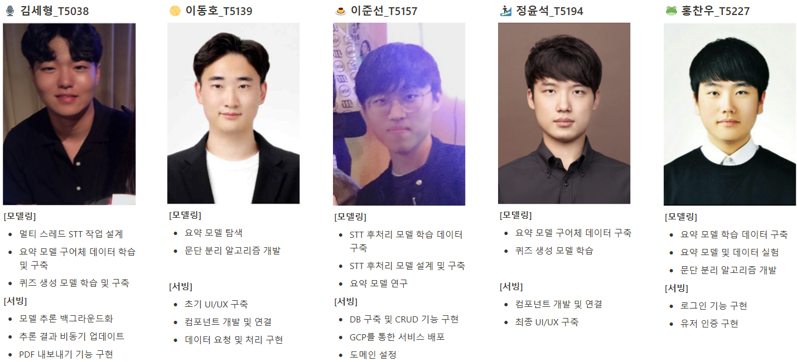
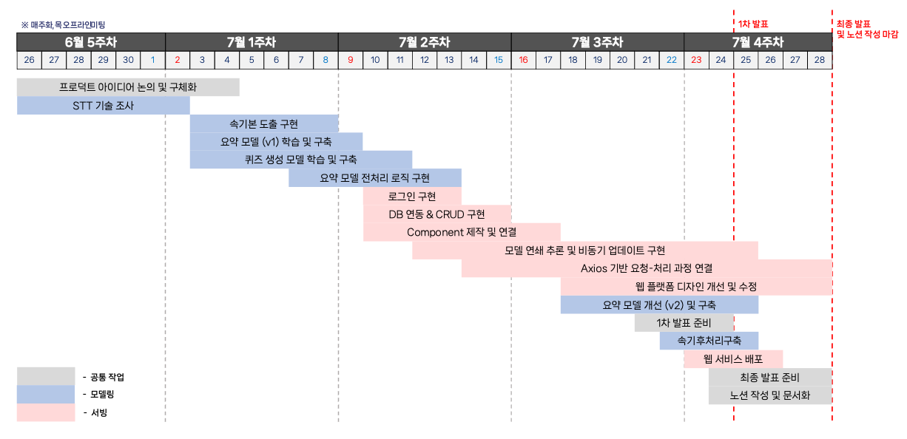
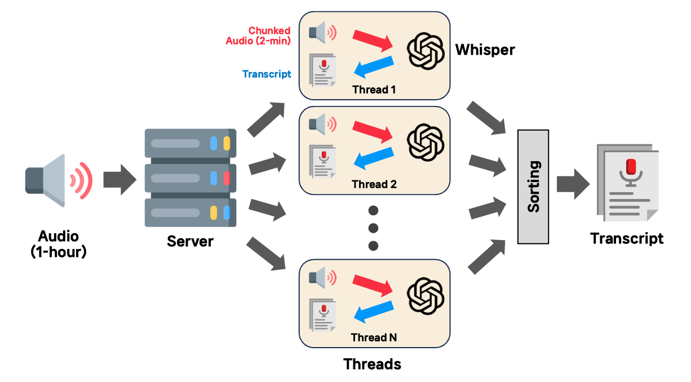
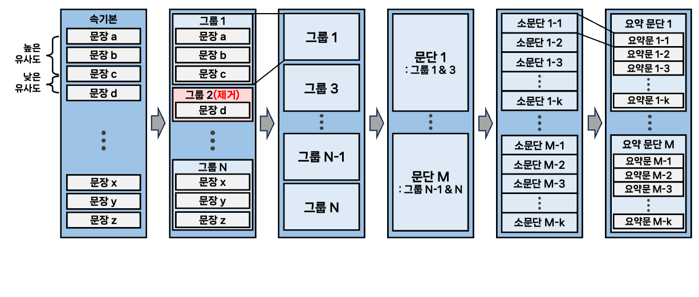
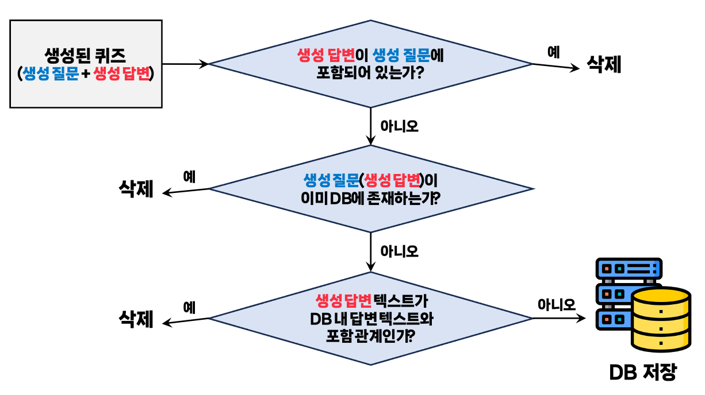

# Lec & Rec: 누가 나 대신 수업 좀 들어줘!

### ⬇️ 서비스 웹 페이지 (테스트 용 ID: test, PW: 1234)
http://lecnrec.kro.kr

## 🤷🏻‍♂️ Lec & Rec은 왜 사용하나요?

- Lec & Rec은 끊임없이 배우고자 하는 분들이 **보다 효율적으로 학습할 수 있는 도구를 제공**해요
- Lec & Rec은 **무엇인가를 배우고자 하는 모든 분들을 위해** 탄생했어요

<br>

## 🤷🏻‍♀️ Lec & Rec은 무엇을 하나요?

### 당신 대신 수업을 들어줍니다.

**Lec & Rec**은 강의 **유튜브 링크**나 **음성 파일**을 입력 받아

**1) 모든 내용을 적은 속기본
2)** **핵심을 빠르고 쉽게 파악할 수 있는 요약본
3) 이해도를 체크해볼 수 있는 퀴즈를 제공해요**

- 유튜브 링크나 음성 파일을 입력으로 받아 먼저 속기본을 만들어요
- AI 모델이 속기본으로 요약본과 퀴즈를 생성하게 돼요
- 각각의 결과는 만들어지는 즉시 확인하실 수 있어요

### 이것도 가능해요.

더 **효율적인 학습**을 위해 **Lec & Rec이 추가로 제공하는 기능**은 다음과 같아요.

- 한번 학습으로 끝? ❌
    - 시간이 지나더라도 **언제라도 다시 학습하실 수 있게 히스토리 기능을 제공**해요
- 자신만의 노트를 만들고 싶으신가요? ⭕
    - 모든 내용을 커스터마이즈하실 수 있게 **수정, 삭제 기능을 제공**해요
- 파일로 학습하고 싶으신가요? ⭕
    - 속기본, 요약본, 퀴즈 **원하는 자료를 골라 pdf 형태로 다운**받으실 수 있어요

<br>

## 구동 방법
### 요구사항
`python 3.10`
### clone 및 세팅
```shell
$ git clone https://github.com/boostcampaitech5/level3_nlp_finalproject-nlp-09.git

$ cd level3_nlp_finalproject-nlp-09

$ chmod +x setting.sh
$ ./setting.sh
```

### Frontend setting

**frontend/.env.development 수정**

```python
REACT_APP_BACKEND_SERVER_ADDRESS=<IP주소:포트번호>
```

### Backend setting

**Database setting**

```shell
$ sudo apt install -y alembic

$ cd backend
$ source .venv/bin/activate

$ alembic init migrations
```

**backend/alembic.ini 수정**

```text
sqlalchemy.url = sqlite:///./project.db
```

**backend/migrations/env.py 수정**

```python
import sys
sys.path.append('../backend')
import models
...
...
target_metadata = models.Base.metadata
```

```shell
$ alembic revision --autogenerate
$ alembic upgrade head
```

**backend/secret.py 수정**

```python
JWT_SECRET_KEY = <임의의 문자열>
JWT_ALGORITHM = <암호화 알고리즘> # ex) HS256, AES128
OPENAI_API_KEY = <openai api key>
PORT = <포트번호>
```

### 프로젝트 실행

```shell
# backend 실행
$ python main.py

# frontend 실행
$ cd ..
$ cd frontend
$ sudo npm start
```

<br>
<br>

## 👨‍👨‍👦‍👦 팀 구성 및 역할


<br>

## ⭐ 서비스 아키텍처


<br>

## 🔧 테크 스택
### 자연어처리 모델링


### 프로덕트 서빙


<br>
<br>
<br>


## ⏳ 프로젝트 타임라인


<br>
<br>
<br>

## 🧠 자연어처리 모델링
### 🔊 음성 전사본 생성: Whisper (OpenAI API)


**[목표]**

`음성 품질 대비 강건성` / `전문 용어 인식 정확도` / `빠른 추론 속도`

**[모델 학습]**

- OpenAI Whisper API를 이용한 추론 사용

**[문제 해결 과정]**

- Whisper large-v2 모델 추론시 강건성과 정확도가 확보되나, **추론에 음성 파일 시간의 1/4가 소요**되는 문제(1시간 음성 → 15분 추론)
    - 동일 성능에 빠른 추론 시간 확보 가능한 OpenAI API 사용 결정
    - GPU 리소스를 사용하지 않으므로, **음성을 청킹하여 멀티 스레드로 작업 후 재조합**
- 속기본 문장에 **마침표가 제대로 표기되지 않는** 문제(이후 요약 모델 입력 시 전처리를 위해 올바른 부호 표기 필요)
    - 속도가 빠른 KoBART 기반 모델을 통해 **마침표 후처리 학습**

**[결과]**

- 1시간 음성 기준, **1분 내로 높은 정확도의 속기본 도출**
- 1시간 음성 기준, 2분 내로 후처리 후 DB 업데이트 및 요약 모델 전달

<br>
<br>

### 📝 요약본 생성: T5-based (PKO-T5)


**[목표]**

`핵심 내용 추출` / `요약문 가독성` / `구어체를 문어체로`

**[모델 학습]**

- 한국어 T5 모델 paust/pko-t5-large
- AI Hub의 방송 콘텐츠 대본 요약 데이터 사용
- **IN**: Passage / **OUT**: Summary

**[문제 해결 과정]**

- 문단 구분 없는 **긴 속기본을 요약 모델에 한 번에 입력할 수 없는** 문제
    - **유사도 기반으로 문단을 분리**하고, 분리된 문단을 요약 모델에 주입
- 요약 문장이 **필요 이상으로 짧아지고**, **글의 가독성이 저하**되는 문제
    - 수집 데이터에서 **요약 길이가 긴 데이터만** 추출해 학습
    - 강의 특성에 맞는 **구어체 데이터**로 학습

**[결과]**

- 1시간 분량 영상 기준 약 20개 내외의 문단 생성
- **적절한 길이와 핵심 내용을 함축적으로 포함**한 문어체 요약 생성

<br>
<br>

### 💯 퀴즈 생성: T5-based (mT5)


**[목표]**

`주요 엔티티에 대한 퀴즈 생성` / `문제의 다양성 확보`

**[모델 학습]**

- 다국어 T5 모델 google/mt5-large
- KLUE (MRC)와 SQuAD-Kor-V1에서 Wikipedia 출처인 데이터 사용
- **IN**: Context / **OUT**: Question + [SEP] + Answer

**[문제 해결 과정]**

- 하나의 문단에 여러 세부 주제가 담겨있음에도 불구하고, **동일 문단은 동일 퀴즈만 생성**이 가능
    - **Beam search의 범위를 증가**시켜 질문의 다양성 확보 시도
- Beam search로 도출된 다중 결과가 **질문과 답이 매우 유사하거나 중복**되는 문제
    - 포함 관계에 대한 **rule-based 후처리**를 통해 퀴즈 퀄리티 확보

**[결과]**

- 1개의 요약 문단에 대해 **최대 3개의 서로 다른 퀴즈** 제공
- 1시간 음성 기준, 약 20~30개의 퀴즈 제공 가능

<br>
<br>

## 🍽️ 프로덕트 서빙

### 🔆 프론트엔드: React

**[목표]**

- 가독성 향상을 통한 유지 보수 용이
- 요청 방식의 최적화를 통한 UI/UX 개선
- Single Page Application을 통한 로딩 시간 단축

**[과정]**

- 하나의 페이지를 하나의 컴포넌트로 작성하니 가독성이 떨어짐
    - 메인 파일을 총 세 개의 서브 컴포넌트로 구성
- Long polling의 경우 데이터가 완성 되지 않으면 다른 작업을 수행할 수 없음
    - Short polling 이용
- 공통분모를 가지는 컴포넌트들을 각각의 페이지로 분리하여 라우팅을 적용한 결과 Single Page Application이 되지 않는 문제 발생
    - 중첩 라우팅을 도입하여 각각의 페이지를 하나의 컴포넌트로 통합

**[결과]**

- 메인 파일 내의 컴포넌트들을 관리, 변경하기 용이해짐
- 요약본, 퀴즈가 생성 되는 동안 생성된 속기본 및 이전 히스토리 내용을 확인할 수 있음
- 라우팅시 전체페이지가 새로고침 되지 않아 로딩 시간 단축

<br>

### 🌙 백엔드: FastAPI + SQLite

**[목표]**

- 업로드 이후 사용자의 대기시간 감소
- 사용자의 편의성 증대와 과거 기록 관리 용이성 확보
- 서비스 보안성 향상

**[과정]**

- 속기본, 요약본, 퀴즈 생성이 모두 완료될 때까지 반환 지연
    - 속기본 생성 후 반환
    - 요약 및 퀴즈 생성을 백그라운드로 실행
- 과거 기록 열람 및 수정 필요
    - User, History, QnA 세 개의 테이블로 DB 구축
- URL을 통한 다른 계정 접근이 가능 했음
    - POST 방식을 사용해 URL을 통한 접근 차단
    - Json Web Token로 사용자 인증 및 보안 강화

**[결과]**

- 백그라운드 실행을 통한 대기시간 60% 감소
- 과거 기록의 자유로운 수정 및 삭제를 통한 UX 향상

<br>
<br>

## 🌐 서비스 배포: Google Cloud Platform + GPU Server (V100)

- GCP를 사용하여 웹 페이지 실행
- AI Stage 서버를 사용하여 모델 추론 및 백엔드 서버 실행